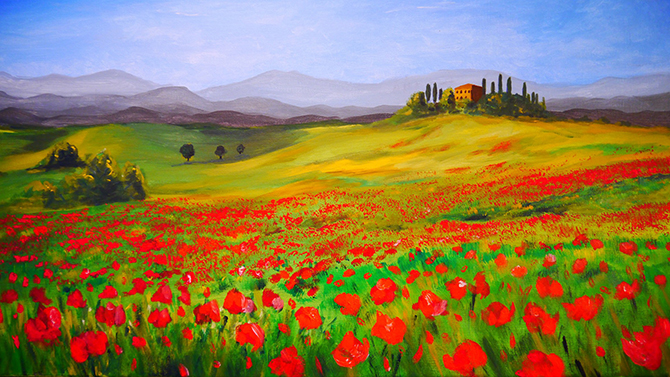
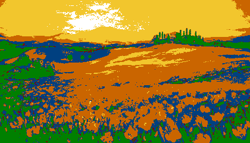

# Rubik's cube image converter

## Description

This script generates an image of another image based on how it would look like if you "built" it with Rubik's cubes.  
It also generates a text file describing which color should go in each spot. This file is named the same as the output file, except it's a .txt file. (To be improved)

In the output image each pixel represents a cubie on the cube.

### Generated text file

This file contains which colour should go in which spot.

- O: Orange
- R: Red
- Y: Yellow
- W: White
- G: Green
- B: Blue

### Note

You have to set the colours in the script according to your Rubik's cube.  
The default colour scheme is from my stickerless DaYan ZhanChi 2x2.

## Usage

```bash

python main.py <input image> <width> <height> <output file>

```

- input image: name of the file you want to convert
- width: width of the output image in pixels
- height: height of the output image in pixels
- output file: name of the output file (with extension)

## Example output

Original image:  


Generated image:  


